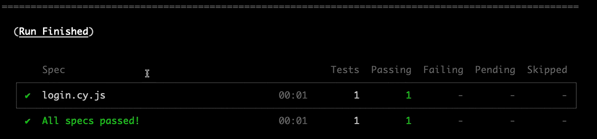

# Cypress intermediário

## instalação e configuração cypress

### Requisitos
- Computador com no minímo 2 cores
- 8 GB no minímo de memória RAM
- Docker
- GIT bash (instalados)
- Node.JS
- npm
- Google chrome
- Visual studio Code

* $ npm init -y
* $ npm instal cypress
* $ npx cypress open

* $ docker --version && git --version && node --version && npm --version

### clonando o projeto

git clone https://github.com/erickson-martinez/intermediate-cypress.git

## O que vamos desenvolver  

Como configurar o ambiente local de desenvolvimento
Como instalar e configurar o Cypress
Como criar testes automatizados de interface gráfica de usuário

Como criar testes automatizados de API (com feedback visual no navegador)
Como testar APIs que necessitam um token de acesso
Como criar testes otimizados e direto-ao-ponto
Como salvar a sessão do usuário no navegador para posterior restauração
Como validar se a sessão do usuário ainda é válida e como lidar com isso quando a mesma é invalidada
Como fazer a limpeza e criação da massa de dados antes do teste começar
Como proteger dados sensíveis, tais como senhas e tokens de acesso
Como organizar os testes e comandos customizados em diferentes "camadas" (API, CLI, GUI)
Como estruturar os testes pensando em pré-condições, ações e resultados esperados
Como gerar dados aleatórios para uso nos testes automatizados
Como habilitar funcionalidades experimentais do Cypress
Como executar comandos à nível de sistema operacional
E como testar a leitura de arquivos